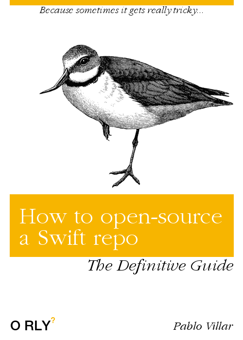
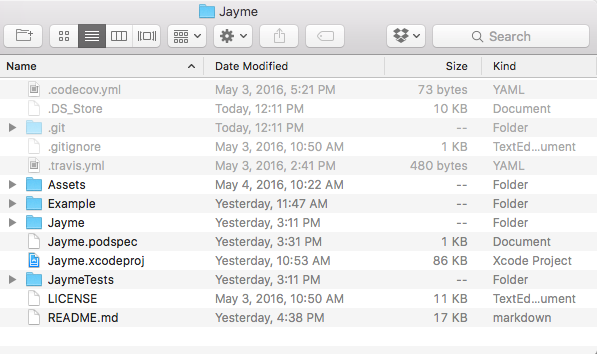
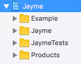
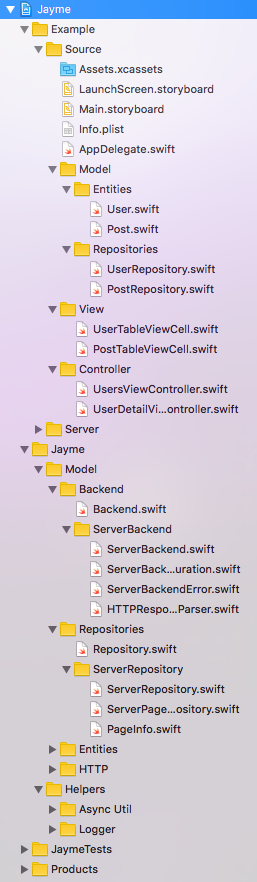

***

**Notes:**

- I based this tutorial on how [**Jayme**](https://github.com/inaka/Jayme) library was built. Check it out for further reference. 
- Whenever you see `Jayme` -like names in the examples, you must think of it in terms of your library name (e.g. if your library is named `Foo`, whenever you see, for example `JaymeTests`, think of `FooTests` instead).
- This tutorial is strictly under [Inaka's guidelines](https://github.com/inaka/guidelines/) and it's not meant to be a general guideline for every Swift developer, although following it is encouraged.

---

**Table of Contents:**

1. [Project Organization](#1-project-organization)
2. [Cocoapods Integration](#2-cocoapods-integration)
3. [Documentation](#3-documentation)
4. [CI Setup](#4-ci-setup)


---

## 1. Project Organization

*Where should your files go? How should you organize your project structure? Should an example project go separated… or should it go within your library's repo?*

We are going to use **only one project** for holding both the library and the example, and then, let cocoapods do the work of only fetching the library part for integration with other projects.

#### i. Physically (in Finder)



You have a main folder (the one that's opened in the screenshot) whose name must match the repo name.

Inside that folder you need to have:

- **The library folder** (in the example: `/Jayme`), which is where your library files will go into. This folder comes by default when you create an Xcode project; however, it usually contains by default files like `AppDelegate.swift` or `Main.storyboard`, which are very likely to live among your example project files (you will usually move them). Just make sure **only the files you create for your library** go physically under this folder.
- An **Example** folder (in the example: `/Example`), which is where your classes for the example will go into. This folder doesn't come by default; you must create it. Also, make sure you move all the default files that your example is going to use in there (e.g. `AppDelegate.swift`, `Main.storyboard`, `Info.plist`, `Assets.xcassets`, `ViewController.swift`, etc.).
  - ⚠️ Since by default the `Info.plist` file does not belong to the `Example` folder, make sure that after moving it there, your project configuration is set to point to the new `Info.plist` file location. For doing so, go to Xcode and check your Target settings, under the Info tab.
- Optionally, an **Assets** folder if your `README.md` includes images; they will go there.
- Other loose files:
  - `LICENSE.md`
  - `README.md`
  - Configuration files, such as:
    - `.gitignore`, `.git`
    - Your library's `.podspec` (more on that [later](#2-cocoapods-integration)) 
    - And possibly, others like `.codecov.yml` and `.travis.yml` (more on that [later](#4-ci-setup))


#### ii. Logically (in Xcode)



You need to have these 4 folders within your root project folder:

- **Example**: Where all the example files go.
- **Jayme**: Where all your library files go.
- **JaymeTests**: Where the test files for your library go.
- **Products**: Group that comes by default in any Xcode project, where outputs go.

If any of those is missing, add it by going to File > Add Files to (your project) and selecting the folder that's missing.

Inside those folders, you can group and organize stuff physically and logically as you want. I personally suggest only logical (Xcode) grouping and not physical (actual folders) inside them, unless it's for a very specific separated functionality, like `Server` in Jayme.



---

## 2. Cocoapods Integration

You must follow [this guide](https://github.com/inaka/guidelines/blob/master/how-to-podify.md) for a step-by-step reference on how to podify your Swift repo.

⚠️ **Important:** Knowing *how-to* is not enough. There are some gotchas that you need to be aware of. They are described below.

#### i. Access Control

Every API that you need to expose (classes, protocols, variables, functions, etc) must be marked as `public`. Otherwise, other projects using your library as a third party integration won't be able to work with it.

Make sure you don't expose internal stuff that you don't need to expose to others. Check out [the official documentation](https://developer.apple.com/library/ios/documentation/Swift/Conceptual/Swift_Programming_Language/AccessControl.html) for further reference on the topic.

In order to ensure that your library does work as a third party component in other project, you must have a release working with cocoapods already. Create a new fresh Xcode project, just for testing integration, and fetch your library as a pod from that project. Try using your library, if you get no compiler errors and you're able to work with all the components as you would expect to, then you're good to go. Otherwise, you have to make sure you've declared all your public APIs as `public`, and once done, upload a new version of the library with those fixes. 

💡 A quick way of testing access control changes without making a new release is editing the `podfile` of your integration test project by using a line that specifies the branch or specific commit that you need to test, for example: `pod 'Jayme', :git => 'git@github.com:inaka/Jayme.git', :branch => 'v2'` and running `pod install`.

#### ii. Tags and Versioning

[Versioning](http://semver.org/spec/v2.0.0.html) is a fundamental concept you should be familiar with if you're writing libraries.

Cocoapods only fetches versions of your repo that are Releases. Therefore, each time you want to update your pod spec, you need to create a new release with its corresponding tag in your repo.

⚠️ **Don't forget to check the following items before creating a release:**

- All your files are updated with all the changes you need.
- The `.podspec` file is updated with its `s.version` field pointing to the tag you're about to create.
- The `README.md` and any required documentation is updated.

If you ever forget something and you already created the release, it won't be enough with deleting the release and re-creating it; you will first need to delete its associated tag and re-create it, pointing to the new commit where you want your release. Here's a [quick guide](http://stackoverflow.com/a/8044605) on how to do so.

Also, here's a useful checklist for those scenarios where you need to **rename** stuff in your code (variables, classes, protocols, etc):

```markdown
Renaming process checklist:

[ ] Every appearance in code is renamed
[ ] Every according file is renamed
[ ] Project builds successfully
[ ] Tests pass successfully
[ ] There is a deprecation/migration mechanism implemented in code
[ ] README is updated
[ ] CHANGELOG is updated
```

#### iii. Documentation

Cocoapods fetches your `README.md` for presenting it in your pod spec page. You can check it out by using a URL like http://cocoadocs.org/docsets/Jayme/1.0.4/.

⚠️ It's important that any **image reference** you include in your `README.md` has an absolute path structured like the following examples:

- https://raw.githubusercontent.com/inaka/Jayme/master/Assets/logo.png
- https://raw.githubusercontent.com/inaka/Jayme/master/Assets/architecture-diagram-1.png

If you do not use this *raw-like* format for your images it's very likely that cocoadocs won't be able to fetch them.

---

## 3. Documentation

#### i. Code documentation

Follow [this guide](http://nshipster.com/swift-documentation/) to know how to properly document your Swift code.

It's very important that any API you expose is well-documented so that your library is certainly practical for projects that needs to integrate with it.

#### ii. README file

Your library's README should follow our [Swift open-source README documentation guidelines](SWIFT-README-GUIDELINES.md).

---

## 4. CI Setup

Continuous integration in your library is optional. However, is highly recommended that you setup CI if your library is likely to reach a considerable audience. If your library is just a small thing that will have a very limited public and very specific use cases, then it's recommended that you do not waste time setting up CI.

#### i. [Travis CI](https://travis-ci.org/)

Travis is a **continuous integration online platform** which is free for open-source projects. 

Setting it up in your library is straightforward:

1. Go to the travis website and give it the accesses it requests to your github account.
2. Switch on the repository you're working with. To do so, you need to have **admin access** to the repo. Ask [Nacho](https://github.com/imendi) for it.
3. Add a `.travis.yml` file in your repo's root folder and configure it by using [Jayme's one](https://github.com/inaka/Jayme/blob/master/.travis.yml) as template.
4. Add a badge to your `README.md` which links to the travis page of your project. See [Jayme's one](https://github.com/inaka/Jayme/blob/master/README.md) as example.

#### ii. [Codecov](https://codecov.io/)

Codecov is a **code-coverage analyzer tool** that integrates easily with github.

Setting it up is simple too:

1. Go to the codecov.io website and login with your github user.
2. Add your github repo there.
3. Add a `.codecov.yml` file in your repo's root folder and configure it by using [Jayme's one](https://github.com/inaka/Jayme/blob/master/.codecov.yml) as template. Watch out for paths to ignore where you don't want coverage data to be gathered from (for instance, the example project that is located within your repository). You can also check [their documentation](https://codecov.io/gh/inaka/Jayme/settings/yaml) for advanced configurations.
4. Add a badge to your `README.md` which links to the coverage report page of your project. See [Jayme's one](https://github.com/inaka/Jayme/blob/master/README.md) as example.

